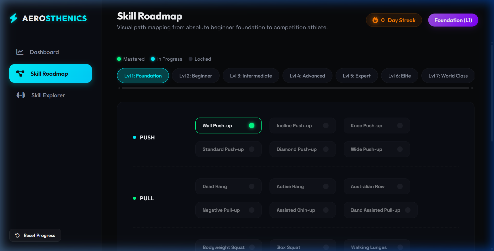
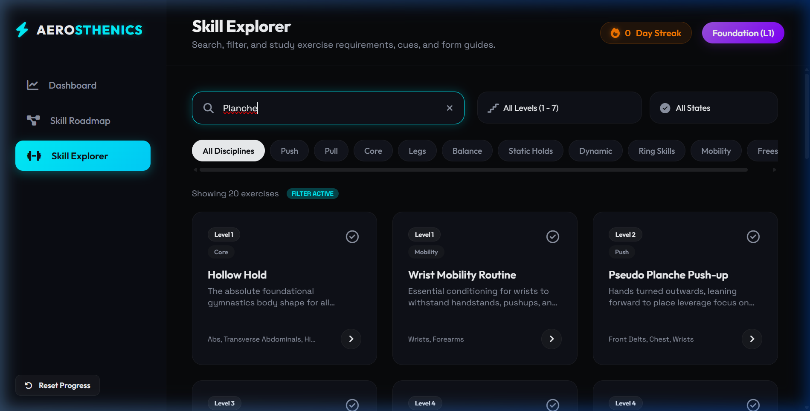
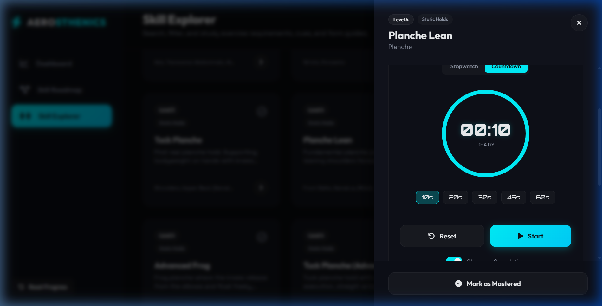
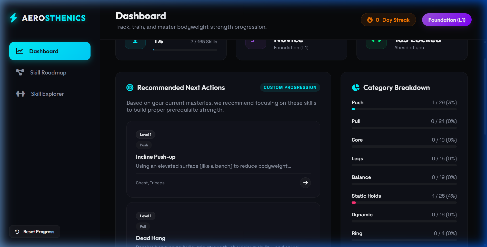

# SHAWORKOUTS | Interactive Calisthenics Progression & Roadmap

A premium, high-fidelity single-page web application designed to help athletes learn, track, and master bodyweight calisthenics skills from complete beginner (Level 1) to world-class competitor (Level 7). 

Built with a responsive, glassmorphic design and an obsidian-dark aesthetic with dynamic neon accents.

---

## 📸 Interface Preview

### 1. Dashboard Overview
Track overall progress, current rank status, training streaks, and get intelligent prerequisite-based workout recommendations.


### 2. Swimlane Progression Roadmap
A clean visual representation of skills in your active training level, divided into lanes (Push, Pull, Legs, Core, Balance, Holds). Color-coded status dots indicate whether a skill is Mastered (Green), In Progress (Cyan), or Locked (Gray).


### 3. Searchable Skill Explorer
Filter by level, category, mastery status, or use the real-time search input matching skill names, muscles, and descriptions.


### 4. Interactive Detail Drawer & Active Training Timer
Slide out skill guides explaining forms, steps, common errors, and prerequisites. Toggle between Stopwatch and Countdown timers with presets and chime notifications.


### 5. Updated Progress Statistics
Watch your category meters and progress bars grow in real-time as you log practice sessions and check off masteries.


---

## ⚡ Features & Interactivity

* **Comprehensive Database**: Includes over 100+ standard calisthenics exercises divided into 7 distinct levels and 10 categories.
* **Prerequisite Tree Checks**: Skill drawers automatically identify and warn you of missing prerequisite skills. Clicking a prerequisite navigates you to it instantly.
* **Dual-Mode Practice Timers**:
  * *Stopwatch Mode*: Counts up to record active holds or set duration.
  * *Countdown Mode*: Provides quick presets (10s, 20s, 30s, etc.) and plays a chime upon completion.
  * *Circular Progress Ring*: Visual SVG countdown glow.
* **Workout Session Logger**: Track sets and reps for each exercise, storing a history list in the drawer.
* **Streaks & LocalStorage Integration**: Keeps count of your consecutive training days and persists all progress, logs, and streaks in your browser.
* **Zero Dependencies**: Pure HTML, CSS, and JS. Fast load time and no package configuration required.

---

## 🛠️ Technology Stack

* **Structure**: Semantic HTML5 markup
* **Styling**: Vanilla CSS3 (CSS Grid, Flexbox, custom properties, glassmorphism, responsive media queries, and keyframe animations)
* **Logic**: Vanilla ES6 JavaScript (LocalStorage state management, custom events, and DOM manipulation)
* **Iconography**: FontAwesome Vector Icons (CDN)
* **Typography**: Google Fonts (Outfit, Space Grotesk, Orbitron)

---

## 🚀 Running Locally

Because the project is written in pure vanilla web technologies, there is no build step or package installations. 

1. **Option A (Double Click)**: Simply double-click the `index.html` file to run the site directly in your default browser.
2. **Option B (Local Server - Recommended for audio and relative files)**: Run a local HTTP server inside the project root:
   ```bash
   # Using Python
   python -m http.server 8000
   
   # Using Node.js
   npx http-server -p 8000
   ```
   Then open your browser and navigate to `http://localhost:8000`.
